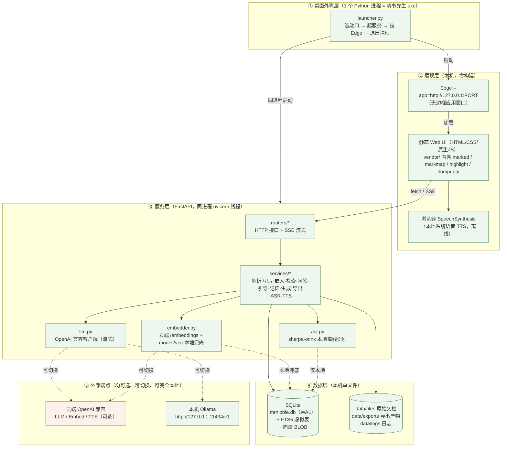
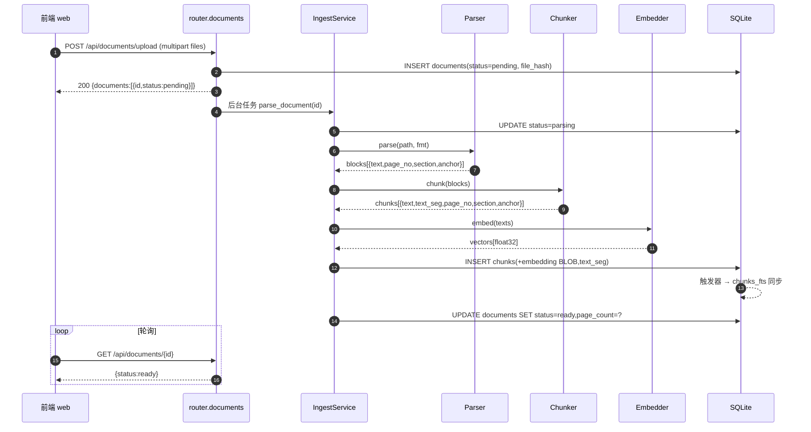
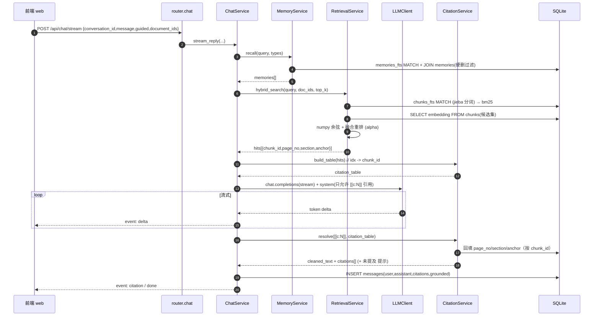
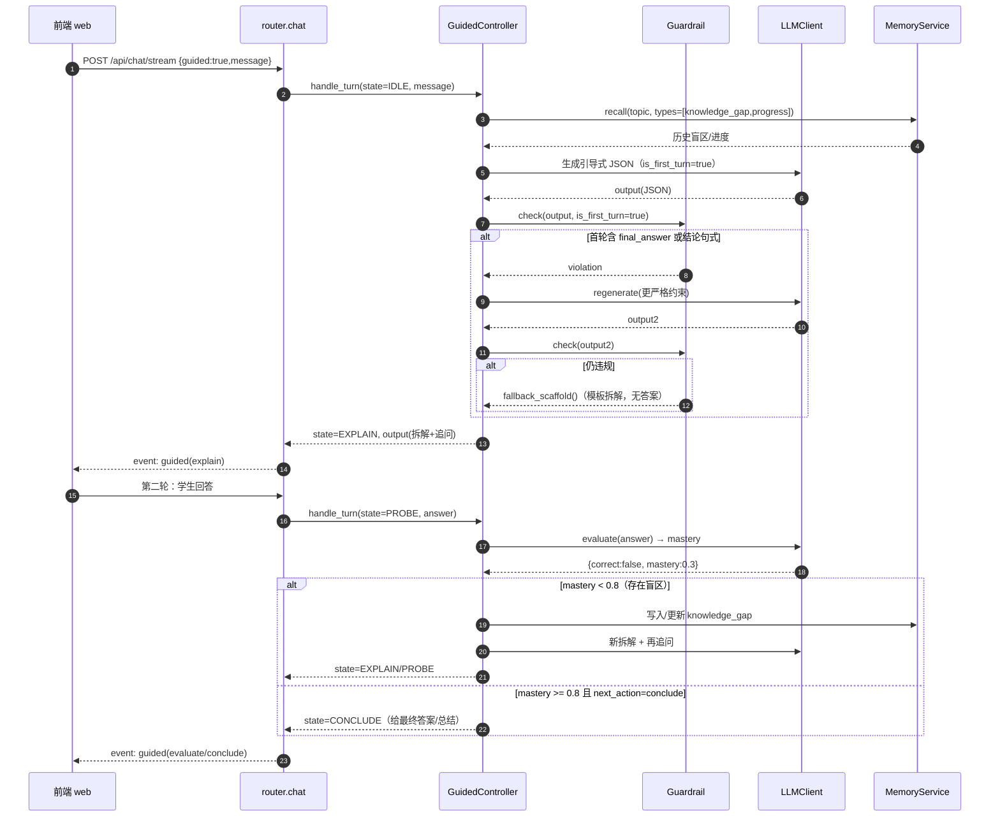
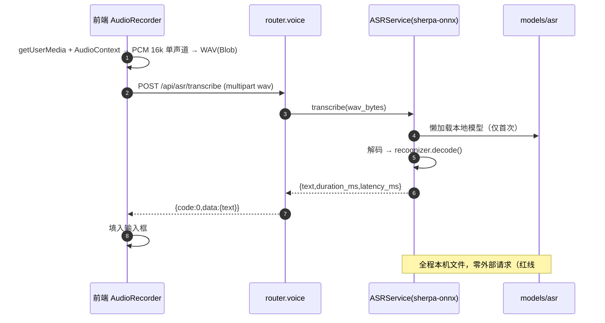
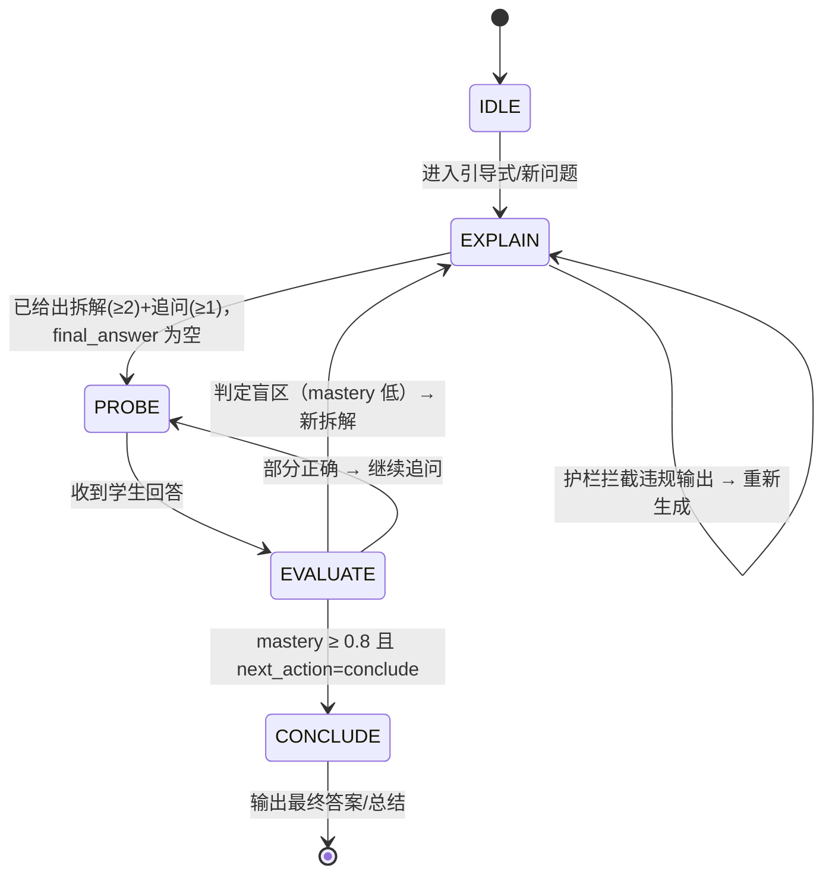
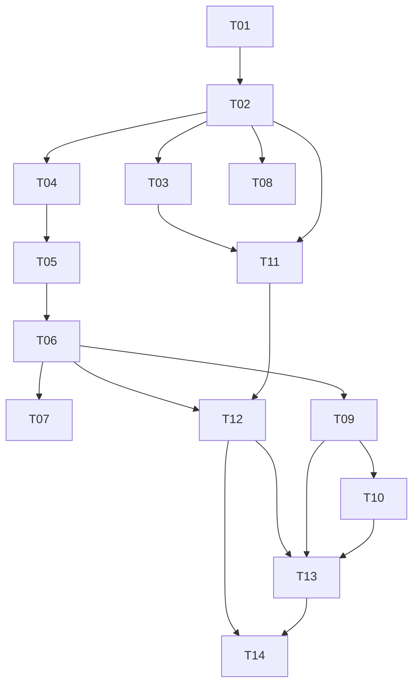

# 啃书先生（MrNibble）系统架构设计与任务分解

| 项 | 值 |
|---|---|
| 文档版本 | v1.0 |
| 文档类型 | 系统架构设计 + 施工任务清单（架构师交付物） |
| 语言 | 简体中文 |
| 上游依据 | `00-项目约束与背景.md`、`01-PRD.md`（48 条需求）、`语音方案本地vs云端.html` |
| 下游消费者 | 工程师（寇豆码）施工、QA（严过关）编写测试、主理人打包 |
| 模块/框架 | 全部使用开源件；前端零构建；绿色包可打包为前提 |

> 本文是工程师的**施工图**：文件清单完备到"照着建就能建起来"，接口契约完备到"照着写就能联调"，任务列表有序到"一批一批写并自测"。

---

## 0. 设计总纲（一句话）

**一个 Python 进程承载「本机侧车服务（FastAPI）+ 桌面外壳（启动器）」，数据全部落在程序目录内的单个 SQLite 文件；前端是纯静态页面，由启动器拉起的 Edge `--app` 窗口加载；所有第三方前端库与本地模型随包分发，全程不依赖 CDN、不依赖开发者服务器、不依赖 Docker/Node。**

---

## 1. 架构总览

### 1.1 分层图



### 1.2 进程模型（谁拉起谁 / 端口 / 清理）

| 进程 | 数量 | 角色 | 生命周期 |
|---|---|---|---|
| `啃书先生.exe`（launcher，Python） | 1 | 主进程。内部以**守护线程**运行 uvicorn（FastAPI），并负责拉起 Edge | 由用户双击启动；Edge 窗口关闭后自行退出 |
| `msedge.exe --app=...` | 1（或复用已有 Edge 实例） | 展现窗口，加载本机 Web UI | 用户关闭窗口即退出 |
| 模型推理（ONNX / model2vec） | 0（进程内线程池） | ASR / 嵌入推理在同进程的线程池执行，不额外起进程 | 随主进程 |

**启动时序**：
1. 读取配置（端口偏好、数据目录）。
2. 选端口：默认 `8760`；被占用则向上探测到第一个空闲端口（`socket.bind(('127.0.0.1', p))` 试探）。若配置 `server.port=0` 则完全随机。
3. 在守护线程启动 uvicorn，绑定 `127.0.0.1:<port>`（**绝不绑 0.0.0.0**）。
4. 轮询 `/api/health` 直到就绪（超时 15s，失败则弹系统错误并退出）。
5. 定位 `msedge.exe`（优先注册表 `App Paths\msedge.exe`，退化到标准安装路径）；以
   `msedge.exe --app=http://127.0.0.1:<port> --user-data-dir=<data>/edge-profile --no-first-run --no-default-browser-check` 启动。
6. **等待 Edge 退出**（`Popen.wait()`）→ 触发 uvicorn 优雅停机 → SQLite `WAL` checkpoint → 关闭日志 → 退出。
7. 兜底：若找不到 Edge，改用 `webbrowser.open(url)` 打开默认浏览器，保持服务运行，用户可通过界面「退出啃书先生」按钮（`POST /api/system/shutdown`）结束。
8. 兜底：`Ctrl+C` / `SIGTERM` 触发 `atexit` 清理（停止 uvicorn 线程、关闭 Edge 子进程）。

> 端口与运行态写入 `data/runtime.json`（`{port, pid, started_at, url}`），便于调试与外部工具读取。

### 1.3 关键设计取舍（为什么是"一个进程 + Edge"）

- **一个进程**：避免多进程通信与孤儿进程；PyInstaller `--onedir` 本就产出单入口。
- **Edge `--app` 而非 WebView2/Electron**：Windows 必装 Edge，零额外运行时、零打包体积；`--user-data-dir` 独立配置目录保证与用户日常浏览器隔离。
- **前端零构建**：无 Node 构建链 → 绿色包只需打包静态文件；`vendor/` 手工/脚本下载一次即随包。
- **SSE 而非 WebSocket**：问答/生成是"服务端持续推、客户端读"的单向流，SSE 用原生 `EventSource`（或 fetch reader）即可，实现成本最低；ASR 为"整段上传→整段返回"，无需 ws。

---

## 2. 技术选型表

> 全部包已在本机 `Python 3.13 / win_amd64` 上验证存在可用 wheel（清华源 `https://pypi.tuna.tsinghua.edu.cn/simple`）。版本为实测解析结果。

| 领域 | 选了什么 | 替代方案 | 为什么选它 | 对应需求 |
|---|---|---|---|---|
| 后端框架 | FastAPI `0.141.1` + uvicorn | Flask / Litestar | 原生异步、SSE/流式友好、Pydantic 校验即接口契约 | R-I01、全局 |
| ASGI 服务器 | uvicorn（`standard`） | hypercorn | 轻、稳、单进程线程内可嵌 | R-I01 |
| 数据校验 | Pydantic v2 | dataclass | 与 FastAPI 同源，schema 即文档 | 全局 |
| 存储 | SQLite（Python 内置，实测 3.53.1，含 FTS5） | DuckDB / Chroma | 单文件、便携、WAL 并发读、内置 FTS5 | R-I03、红线#10 |
| 向量检索 | 嵌入向量存 BLOB + numpy 暴力余弦 | FAISS / Chroma / sqlite-vec | 单机单人数据量（万级 chunk）下暴力检索 <50ms，零额外依赖 | 八件套#2、R-H04 |
| 关键词检索 | SQLite FTS5（`unicode61`）+ **jieba 分词** | FTS5 `trigram` | 实测 trigram 对 2 字中文词（"极限"）**无法命中**；jieba 分词后 unicode61 对中文命中可靠 | 八件套#2 |
| 中文分词 | jieba `0.42.1` | pkuseg | 纯 Python、pip 可装、成熟 | 八件套#2 |
| 数值计算 | numpy `2.5.3` | 无 | 向量运算、BLOB 编解码 | R-H04 |
| 文档解析 | pypdf / python-docx / python-pptx / BeautifulSoup4+lxml | unstructured | 各自格式最成熟、体积小、可按需装 | R-A02~A07 |
| 嵌入（云端） | OpenAI 兼容 `/embeddings` | 各厂商 SDK | 一套协议通吃 OpenAI/智谱/百炼/SiliconFlow/Ollama | R-H01、R-H04 |
| 嵌入（本地兜底） | `model2vec 0.9.0`（静态嵌入，纯 numpy 无 torch） | ONNX 小模型+onnxruntime / 纯 FTS5 | pip 可装、无 torch、体积小、断网可用；退化到 FTS5 仍可用 | R-H04、红线#7 |
| LLM 客户端 | httpx `0.28.1`（手写 OpenAI 兼容调用） | openai SDK | 可控超时/流式/日志脱敏；不引入 SDK 隐式日志泄露 Key 风险 | R-H01~H03、红线#1 |
| LLM 协议 | OpenAI 兼容 `chat/completions`（流式） | Anthropic 原生 | 用户可自由切换端点，含 Ollama 兼容端点 | R-H02、R-H03 |
| 本地 ASR | **sherpa-onnx `1.13.8`**（主） + onnxruntime `1.30.0` | faster-whisper（备，ctranslate2 `4.8.2`） | 离线、体积小、有中文 SenseVoice/Paraformer 模型、无需 torch；实测 `cp313-win_amd64` 有 wheel | R-G01、R-G02、红线#3 |
| ASR 模型 | SenseVoice-small（int8 ONNX） | Paraformer-zh 流式 | 轻量、CPU 可跑、含中文；流式非必需（我们整段识别） | R-G01 |
| 本地 TTS | 浏览器 `SpeechSynthesis`（调 Windows SAPI） | Piper / sherpa-onnx TTS | 零依赖、零 Key、离线；满足"本地系统语音"档 | R-G04、R-G03 |
| 云端 TTS | OpenAI 兼容 `/audio/speech`（服务端代理） | Azure / 豆包 | 与 LLM 同类协议，Key 独立配置 | R-G05 |
| 导出·Anki | genanki `0.13.1` | 手写 apkg | 成熟、生成标准 `.apkg` | R-D01 |
| 导出·CSV/MD | Python 内置 csv + 字符串模板 | pandas | 无需重依赖 | R-D02、R-D03 |
| 导出·导图图片 | 前端 markmap 渲染 SVG → canvas → PNG，回传服务端存盘 | 服务端 Playwright 渲染 | 避免引入无头浏览器（重、不可打包友好） | R-D04 |
| 前端 Markdown | `marked`（随包 vendor） | markdown-it | 体积小、快 | R-C01、R-C02 |
| 前端 XSS 清洗 | `DOMPurify`（随包 vendor） | 自写 | 渲染 LLM 输出必须清洗 | 红线#2 |
| 前端思维导图 | `markmap-lib` + `markmap-view` + `d3`（随包 vendor） | 自写 SVG | PRD 指定 markmap | R-C03、R-D03 |
| 前端代码高亮 | `highlight.js`（随包 vendor） | prism | 通用 | R-C01 |
| 密钥加密 | `cryptography 50.0.1`（Fernet） | 明文 | 本机静态加密，Key 不进日志、不下发前端 | 红线#1 |
| 配置 | `.env`（启动引导）+ `settings` 表（运行期） | 纯 env | Key 走加密表，非密配置走 env；UI 可改 | R-H01 |
| 打包 | PyInstaller `--onedir` | Nuitka / cx_Freeze | 免安装绿色包、启动快、`--onedir` 便于放模型与静态资源 | R-I01、R-I02 |
| 桌面外壳 | 系统 Edge `--app` | WebView2 / Electron | 零额外依赖 | R-I02 |

---

## 3. 目录与文件清单

> 根目录：`Q:\xiaolongxia\xiaxia\hyperknow调研\zhiban`。源码在 `src/`，文档在 `docs/`。

```
mrnibble/
├─ README.md                         # 部署/配置 API/常见问题（交付物③④）
├─ LICENSE                           # 本项目许可
├─ .env.example                      # 配置模板（端口/数据目录/可选 env 覆盖）
├─ .gitignore                        # 忽略 data/、models/、.venv/、build 产物
├─ requirements.txt                  # 运行时依赖（锁定版本）
├─ requirements-dev.txt              # 开发/打包依赖（pyinstaller、pytest 等）
│
├─ build/
│  ├─ build.ps1                      # 一键构建：装依赖→拉 vendor→下模型→PyInstaller→产出 dist
│  ├─ mrnibble.spec                    # PyInstaller 配置（datas 打入 web/models，onedir）
│  └─ version_info.txt               # Windows 版本资源
│
├─ scripts/
│  ├─ run_dev.ps1                    # 开发态启动（venv + uvicorn --reload）
│  ├─ fetch_vendor.ps1               # 下载前端第三方库到 src/web/vendor（离线随包，无 CDN）
│  ├─ download_models.ps1            # 下载 ASR/嵌入模型到 models/（可断点续传）
│  ├─ backup.ps1                     # 备份：打包 data/ + models/ 到 zip（R-I05）
│  └─ restore.ps1                    # 恢复：从 zip 还原
│
├─ docs/
│  ├─ 00-项目约束与背景.md            # （已存在）
│  ├─ 01-PRD.md                      # （已存在）
│  ├─ 02-架构设计.md                  # 本文档
│  ├─ 03-用户手册.md                  # 上传/问答/生成复习材料
│  ├─ 04-管理员手册.md                # 模型切换/日志/备份/升级
│  ├─ 05-模型兼容列表.md              # 端点/模型兼容清单（R-I06）
│  └─ 06-第三方依赖与许可.md          # 开源许可清单（R-I06）
│
├─ models/                           # 离线模型（随包分发或首次运行前由脚本下载）
│  ├─ asr/sense-voice-small/         # sherpa-onnx SenseVoice 模型 + tokens
│  └─ embed/potion-base-8M/          # model2vec 静态嵌入模型
│
├─ src/
│  ├─ launcher.py                    # 桌面外壳：选端口→起服务→拉 Edge→退出清理（R-I02）
│  │
│  ├─ backend/
│  │  ├─ __init__.py                 # 包标记 + 版本号 __version__
│  │  ├─ main.py                     # create_app()：装配路由/中间件/静态挂载/异常处理
│  │  ├─ paths.py                    # 资源定位：resource_path()（_MEIPASS）/ data_path()（exe 同级）
│  │  ├─ config.py                   # 配置读取：.env→AppConfig 单例；settings 表读写入口
│  │  ├─ logging_setup.py            # 日志初始化 + SecretMaskingFilter（Key 脱敏）
│  │  ├─ security.py                 # Fernet 加解密、Key 掩码、密钥文件管理
│  │  ├─ errors.py                   # 领域异常 + 错误码表 + 异常处理器
│  │  │
│  │  ├─ db/
│  │  │  ├─ __init__.py
│  │  │  ├─ connection.py            # SQLite 连接池/线程局部连接、WAL、外键、row_factory
│  │  │  ├─ schema.sql               # 全部 DDL（表 + FTS5 + 触发器 + 索引）
│  │  │  └─ migrations.py            # 版本化迁移（schema_meta.version，幂等）
│  │  │
│  │  ├─ models/                     # Pydantic 请求/响应 schema（= 接口契约）
│  │  │  ├─ __init__.py
│  │  │  ├─ common.py                # Envelope、分页、错误响应
│  │  │  ├─ documents.py             # 文档/切片/解析状态 schema
│  │  │  ├─ retrieval.py             # 检索请求/命中 schema
│  │  │  ├─ chat.py                  # 会话/消息/流式事件/引用 schema
│  │  │  ├─ guided.py                # 引导式结构化输出 schema（含护栏字段）
│  │  │  ├─ memory.py                # 记忆 CRUD schema
│  │  │  ├─ generation.py            # 生成请求/产物 schema（quiz/flashcard 等）
│  │  │  ├─ export.py                # 导出请求/结果 schema
│  │  │  ├─ settings.py              # 设置读写/连接测试 schema
│  │  │  └─ voice.py                 # ASR/TTS schema
│  │  │
│  │  ├─ services/
│  │  │  ├─ __init__.py
│  │  │  ├─ ingest.py                # 上传→解析→切片→嵌入→入库 全流程编排
│  │  │  ├─ parsers/
│  │  │  │  ├─ __init__.py           # 解析器注册表 parse(file,fmt)->blocks
│  │  │  │  ├─ base.py               # Block 数据类（text,page_no,section,anchor）
│  │  │  │  ├─ pdf_parser.py         # pypdf 逐页解析，page_no=页码
│  │  │  │  ├─ docx_parser.py        # python-docx 段落，section=标题层级
│  │  │  │  ├─ pptx_parser.py        # python-pptx 逐页，page_no=幻灯片序号
│  │  │  │  ├─ text_parser.py        # txt/md（md 解析标题层级）
│  │  │  │  └─ html_parser.py        # 网页正文提取（BeautifulSoup）
│  │  │  ├─ chunker.py               # 分块（按长度+结构，保留 page/section）
│  │  │  ├─ embedder.py              # 嵌入：云端 /embeddings → model2vec → 无（退化）
│  │  │  ├─ retrieval.py             # 混合检索：FTS5 + 向量 → 融合重排 → 命中
│  │  │  ├─ llm.py                   # OpenAI 兼容客户端（流式/非流式/连接测试）
│  │  │  ├─ chat.py                  # 问答编排（检索→取记忆→拼提示→流式→回引用）
│  │  │  ├─ citations.py             # 引用解析与回填（页码只来自 DB，结构防伪）
│  │  │  ├─ guardrails.py            # 引导式护栏：违规检测 + 重生成 + 兜底模板
│  │  │  ├─ guided.py                # 引导式状态机（讲解/追问/评估）+ 盲区回写
│  │  │  ├─ memory.py                # 记忆 CRUD + 召回（硬删除 + JOIN 主表）
│  │  │  ├─ generation.py            # 五类资料生成（速查表/笔记/导图/Quiz/闪卡）
│  │  │  ├─ export.py                # 导出：Anki/MD/CSV/图片存盘
│  │  │  ├─ asr.py                   # sherpa-onnx 本地识别（懒加载模型）
│  │  │  ├─ tts.py                   # 云端 /audio/speech 代理（本地走浏览器）
│  │  │  ├─ settings_service.py      # settings 表读写 + 掩码 + 连接测试编排
│  │  │  └─ flashcards.py            # 闪卡复习状态（间隔重复状态机）
│  │  │
│  │  ├─ routers/
│  │  │  ├─ __init__.py              # 汇总注册所有 router，统一前缀 /api
│  │  │  ├─ system.py                # /health /info /stats /shutdown
│  │  │  ├─ documents.py             # 上传/列表/详情/删除/预览/重解析/URL
│  │  │  ├─ retrieval.py             # 检索接口
│  │  │  ├─ chat.py                  # 会话 CRUD + 流式问答（含引导式）
│  │  │  ├─ memory.py                # 记忆 CRUD/导出
│  │  │  ├─ generation.py            # 五类生成 + 状态查询
│  │  │  ├─ export.py                # 导出触发/下载
│  │  │  ├─ settings.py              # 设置读写/连接测试/ollama 模型列表
│  │  │  └─ voice.py                 # ASR 转写/TTS 合成/状态
│  │  │
│  │  └─ utils/
│  │     ├─ __init__.py
│  │     ├─ ids.py                   # uuid4 hex / 短 id 生成
│  │     ├─ timeutil.py              # UTC ISO8601 时间戳（唯一时间来源）
│  │     ├─ textutil.py              # jieba 分词封装、截断、hash、页码格式化
│  │     └─ numpy_blob.py            # float32 <-> BLOB 编解码
│  │
│  └─ web/                           # 前端（零构建，随包）
│     ├─ index.html                  # 单页外壳：三栏布局 + 视图容器
│     ├─ css/
│     │  ├─ base.css                 # 变量/字体/重置
│     │  ├─ layout.css               # 三栏栅格
│     │  └─ components.css           # 按钮/卡片/角标/模态
│     ├─ js/
│     │  ├─ api.js                   # fetch/SSE 封装，统一解析 Envelope，错误集中处理
│     │  ├─ store.js                 # 极简状态（当前会话/材料/设置/记忆缓存）
│     │  ├─ router.js                # hash 路由（#/workbench #/generate ...）
│     │  ├─ main.js                  # 入口：初始化路由、加载设置、挂载视图
│     │  ├─ views/
│     │  │  ├─ workbench.js          # 主工作台（对话+引用+记忆面板）
│     │  │  ├─ generate.js           # 资料生成页
│     │  │  ├─ review.js             # 闪卡复习页
│     │  │  ├─ memory.js             # 记忆管理页
│     │  │  ├─ settings.js           # 模型与 API 设置页
│     │  │  └─ voice.js              # 语音设置页
│     │  ├─ components/
│     │  │  ├─ chatPanel.js          # 消息列表 + 流式渲染
│     │  │  ├─ citationPanel.js      # 右侧引用面板 + 跳转定位
│     │  │  ├─ materialList.js       # 左栏资料库/会话列表
│     │  │  ├─ markdownView.js       # marked + DOMPurify + highlight 渲染
│     │  │  ├─ mindmapView.js        # markmap 渲染与导出 SVG/PNG
│     │  │  ├─ flashcard.js          # 卡片翻面组件
│     │  │  └─ audioRecorder.js      # 录音→PCM→WAV（无需 ffmpeg）
│     │  └─ util/
│     │     ├─ dom.js                # DOM 小工具（el/on/qs）
│     │     ├─ sse.js                # EventSource/流读取封装
│     │     ├─ format.js             # 时间/页码/分数格式化
│     │     └─ wav.js                # PCM→WAV 编码（ASR 上传用）
│     └─ vendor/                     # 随包第三方前端库（由 fetch_vendor.ps1 下载，无 CDN）
│        ├─ marked/marked.min.js
│        ├─ dompurify/purify.min.js
│        ├─ highlight/highlight.min.js
│        ├─ highlight/github.min.css
│        ├─ markmap/markmap-lib.min.js
│        ├─ markmap/markmap-view.min.js
│        └─ d3/d3.min.js
│
└─ data/                             # 运行时数据（默认在程序目录内，便携；见 §14）
   ├─ mrnibble.db                      # SQLite 主库（含 FTS5、向量 BLOB）
   ├─ mrnibble.db-wal / -shm           # WAL 文件
   ├─ secret.key                     # Fernet 主密钥（首次运行生成；不进日志/备份明示）
   ├─ runtime.json                   # 运行态：port/pid/url
   ├─ files/                         # 上传的原始文档
   ├─ exports/                       # 导出的 apkg/md/csv/png
   └─ logs/mrnibble.log                # 运行日志（Key 已脱敏）
```

### 3.1 资源定位函数设计（PyInstaller 最常见失败点，必须严格照做）

`paths.py` 提供两个**语义分离**的函数，全项目只允许通过它们取路径：

```python
# paths.py（设计说明，非最终代码）
def resource_path(*parts) -> Path:
    """只读，随包资源（web/、models/、schema.sql）。
    冻结态：sys._MEIPASS 指向 PyInstaller 解包目录（--onedir 下即 _internal/）。
    开发态：项目根目录。"""

def data_path(*parts) -> Path:
    """可写，运行期数据（db/files/exports/logs/secret.key）。
    冻结态：可执行文件所在目录（Path(sys.executable).parent），保证绿色包便携。
    开发态：项目根目录。可用环境变量 MRNIBBLE_DATA_DIR 覆盖。"""
```

**规则**：
- 读静态资源一律 `resource_path("web", ...)` / `resource_path("models", ...)`；**绝不**用 `__file__` 相对路径拼装（冻结后会指向临时目录）。
- 写数据一律 `data_path(...)`，且启动时确保目录存在（`mkdir(parents=True, exist_ok=True)`）。
- `mrnibble.spec` 必须把 `src/web` 与 `models` 写入 `datas`，把 `src/backend/db/schema.sql` 一并打入。
- `data/` **不打入包**，在冻结态自动生成于 exe 同级目录。

---

## 4. 数据模型（SQLite DDL）

> 全部时间戳为 **UTC ISO8601 字符串**（如 `2026-09-11T08:30:00Z`）。
> 所有主键为 `uuid4().hex`。外键开启 `ON DELETE CASCADE`。
> 向量统一 **float32 小端** `numpy.ndarray.tobytes()` 存 BLOB。

### 4.1 表清单与职责

| 表 | 类型 | 职责 | 关键需求 |
|---|---|---|---|
| `schema_meta` | 普通 | 迁移版本 | — |
| `documents` | 普通 | 资料库条目（文件/网页） | R-A01、R-A09 |
| `chunks` | 普通 | 文档切片 + 向量 BLOB + 页码元数据 | R-A02、R-A06、R-A08 |
| `chunks_fts` | **FTS5 虚拟表**（外部内容） | 关键词检索 | R-A03~A05 |
| `conversations` | 普通 | 会话 | R-B05 |
| `messages` | 普通 | 消息 + 引用 JSON | R-B01、R-B02 |
| `memories` | 普通 | 长期记忆（偏好/进度/盲区/事实）+ 向量 BLOB | R-E01~E04 |
| `memories_fts` | **FTS5 虚拟表**（外部内容） | 记忆关键词召回 | R-E03 |
| `generations` | 普通 | 五类生成产物 | R-C01~C05 |
| `flashcards` | 普通 | 闪卡 + 复习状态 | R-C05、复习页 |
| `settings` | 普通 | 配置键值（含加密密钥值） | R-H01 |
| `events` | 普通（可选） | 运行事件（引导状态/检索/调用），供 R-F04 可观测 | R-F04 |

### 4.2 DDL（`db/schema.sql`）

```sql
PRAGMA journal_mode = WAL;
PRAGMA foreign_keys = ON;
PRAGMA busy_timeout = 5000;

CREATE TABLE IF NOT EXISTS schema_meta (
  key   TEXT PRIMARY KEY,
  value TEXT
);

-- ── 资料库 ─────────────────────────────────────────────
CREATE TABLE IF NOT EXISTS documents (
  id            TEXT PRIMARY KEY,
  title         TEXT NOT NULL,
  source_type   TEXT NOT NULL DEFAULT 'file',    -- file | url
  fmt           TEXT NOT NULL,                   -- pdf|docx|pptx|md|txt|html
  original_path TEXT,                            -- data/files 下相对路径（source_type=file）
  source_url    TEXT,                            -- source_type=url
  file_hash     TEXT,                            -- sha256，用于去重
  size_bytes    INTEGER,
  page_count    INTEGER DEFAULT 0,
  status        TEXT NOT NULL DEFAULT 'pending', -- pending|parsing|ready|failed
  error         TEXT,
  collection    TEXT,                            -- 预留分组（单一库 + 可选标签，见 §14/B）
  tags          TEXT,                            -- JSON 数组
  meta          TEXT,                            -- JSON 扩展
  created_at    TEXT NOT NULL,
  updated_at    TEXT NOT NULL
);
CREATE INDEX IF NOT EXISTS idx_documents_collection ON documents(collection);
CREATE INDEX IF NOT EXISTS idx_documents_status     ON documents(status);
CREATE UNIQUE INDEX IF NOT EXISTS uq_documents_hash ON documents(file_hash) WHERE file_hash IS NOT NULL;

-- ── 切片（含向量 BLOB；rowid 供 FTS 外部内容映射）──────
CREATE TABLE IF NOT EXISTS chunks (
  rowid           INTEGER PRIMARY KEY,           -- 隐式整数主键
  id              TEXT NOT NULL UNIQUE,
  document_id     TEXT NOT NULL REFERENCES documents(id) ON DELETE CASCADE,
  ordinal         INTEGER NOT NULL,
  text            TEXT NOT NULL,
  text_seg        TEXT NOT NULL,                 -- jieba 分词后（空格分隔），供 FTS
  token_count     INTEGER,
  page_no         INTEGER,                       -- 页码/幻灯片序号：引用的唯一来源
  section         TEXT,                          -- 章节/标题路径
  anchor          TEXT,                          -- JSON：{char_start,char_end,slide,heading}
  embedding       BLOB,                          -- float32 小端
  embedding_dim   INTEGER,
  embedding_model TEXT,
  created_at      TEXT NOT NULL
);
CREATE INDEX IF NOT EXISTS idx_chunks_document     ON chunks(document_id);
CREATE INDEX IF NOT EXISTS idx_chunks_doc_page     ON chunks(document_id, page_no);

CREATE VIRTUAL TABLE IF NOT EXISTS chunks_fts USING fts5(
  text_seg,
  content='chunks',
  content_rowid='rowid',
  tokenize='unicode61 remove_diacritics 2'
);
CREATE TRIGGER IF NOT EXISTS trg_chunks_ai AFTER INSERT ON chunks BEGIN
  INSERT INTO chunks_fts(rowid, text_seg) VALUES (new.rowid, new.text_seg);
END;
CREATE TRIGGER IF NOT EXISTS trg_chunks_ad AFTER DELETE ON chunks BEGIN
  INSERT INTO chunks_fts(chunks_fts, rowid, text_seg) VALUES ('delete', old.rowid, old.text_seg);
END;
CREATE TRIGGER IF NOT EXISTS trg_chunks_au AFTER UPDATE ON chunks BEGIN
  INSERT INTO chunks_fts(chunks_fts, rowid, text_seg) VALUES ('delete', old.rowid, old.text_seg);
  INSERT INTO chunks_fts(rowid, text_seg) VALUES (new.rowid, new.text_seg);
END;

-- ── 会话与消息 ─────────────────────────────────────────
CREATE TABLE IF NOT EXISTS conversations (
  id           TEXT PRIMARY KEY,
  title        TEXT,
  mode         TEXT NOT NULL DEFAULT 'normal',   -- normal | guided
  document_ids TEXT,                             -- JSON 数组；NULL=全库
  collection   TEXT,
  created_at   TEXT NOT NULL,
  updated_at   TEXT NOT NULL
);
CREATE INDEX IF NOT EXISTS idx_conversations_updated ON conversations(updated_at);

CREATE TABLE IF NOT EXISTS messages (
  id              TEXT PRIMARY KEY,
  conversation_id TEXT NOT NULL REFERENCES conversations(id) ON DELETE CASCADE,
  role            TEXT NOT NULL,                 -- user | assistant | system
  content         TEXT NOT NULL,                 -- 展示用 Markdown（引用已替换为 [n]）
  content_json    TEXT,                          -- 结构化载荷（引导式字段等）
  citations       TEXT,                          -- JSON 数组，见 §8
  grounded        INTEGER DEFAULT 1,             -- 0=含材料外内容
  model           TEXT,
  tokens          INTEGER,
  status          TEXT DEFAULT 'ok',
  created_at      TEXT NOT NULL
);
CREATE INDEX IF NOT EXISTS idx_messages_conversation ON messages(conversation_id, created_at);

-- ── 长期记忆（硬删除；召回 JOIN 主表，见 §9）──────────
CREATE TABLE IF NOT EXISTS memories (
  rowid             INTEGER PRIMARY KEY,
  id                TEXT NOT NULL UNIQUE,
  type              TEXT NOT NULL,               -- preference|progress|knowledge_gap|fact
  content           TEXT NOT NULL,
  content_seg       TEXT NOT NULL,               -- jieba 分词
  source            TEXT NOT NULL DEFAULT 'auto',-- auto|manual
  confidence        REAL DEFAULT 0.5,
  document_id       TEXT,
  conversation_id   TEXT,
  collection        TEXT,
  embedding         BLOB,
  embedding_dim     INTEGER,
  embedding_model   TEXT,
  recall_count      INTEGER DEFAULT 0,
  last_referenced_at TEXT,
  created_at        TEXT NOT NULL,
  updated_at        TEXT NOT NULL
);
CREATE INDEX IF NOT EXISTS idx_memories_type ON memories(type);
CREATE INDEX IF NOT EXISTS idx_memories_collection ON memories(collection);

CREATE VIRTUAL TABLE IF NOT EXISTS memories_fts USING fts5(
  content_seg,
  content='memories',
  content_rowid='rowid',
  tokenize='unicode61 remove_diacritics 2'
);
CREATE TRIGGER IF NOT EXISTS trg_mem_ai AFTER INSERT ON memories BEGIN
  INSERT INTO memories_fts(rowid, content_seg) VALUES (new.rowid, new.content_seg);
END;
CREATE TRIGGER IF NOT EXISTS trg_mem_ad AFTER DELETE ON memories BEGIN
  INSERT INTO memories_fts(memories_fts, rowid, content_seg) VALUES ('delete', old.rowid, old.content_seg);
END;
CREATE TRIGGER IF NOT EXISTS trg_mem_au AFTER UPDATE ON memories BEGIN
  INSERT INTO memories_fts(memories_fts, rowid, content_seg) VALUES ('delete', old.rowid, old.content_seg);
  INSERT INTO memories_fts(rowid, content_seg) VALUES (new.rowid, new.content_seg);
END;

-- ── 生成产物 ───────────────────────────────────────────
CREATE TABLE IF NOT EXISTS generations (
  id           TEXT PRIMARY KEY,
  type         TEXT NOT NULL,                    -- cheatsheet|notes|mindmap|quiz|flashcard
  title        TEXT,
  document_ids TEXT,                             -- JSON 数组
  params       TEXT,                             -- JSON {length,count,...}
  content_md   TEXT,                             -- 速查表/笔记/导图（Markdown）
  content_json TEXT,                             -- quiz:[...]/flashcard:[...]/mindmap tree
  collection   TEXT,
  status       TEXT DEFAULT 'running',           -- running|ready|failed
  error        TEXT,
  model        TEXT,
  created_at   TEXT NOT NULL,
  updated_at   TEXT NOT NULL
);
CREATE INDEX IF NOT EXISTS idx_generations_type ON generations(type);

CREATE TABLE IF NOT EXISTS flashcards (
  id               TEXT PRIMARY KEY,
  generation_id    TEXT REFERENCES generations(id) ON DELETE CASCADE,
  document_id      TEXT,
  question         TEXT NOT NULL,
  answer           TEXT NOT NULL,
  tags             TEXT,                         -- JSON 数组
  sr_state         TEXT,                         -- JSON {ease,interval,due,reps,lapses}
  created_at       TEXT NOT NULL,
  updated_at       TEXT NOT NULL,
  last_reviewed_at TEXT
);
CREATE INDEX IF NOT EXISTS idx_flashcards_generation ON flashcards(generation_id);

-- ── 配置（密钥加密存储）───────────────────────────────
CREATE TABLE IF NOT EXISTS settings (
  key        TEXT PRIMARY KEY,
  value      TEXT,
  is_secret  INTEGER DEFAULT 0,
  updated_at TEXT NOT NULL
);

-- ── 运行事件（可观测，R-F04）───────────────────────────
CREATE TABLE IF NOT EXISTS events (
  id      INTEGER PRIMARY KEY AUTOINCREMENT,
  ts      TEXT NOT NULL,
  kind    TEXT NOT NULL,                         -- guided_state|retrieval|llm_call
  payload TEXT                                   -- JSON（已脱敏）
);
CREATE INDEX IF NOT EXISTS idx_events_kind_ts ON events(kind, ts);
```

### 4.3 `settings` 键约定

| key | 是否密文 | 说明 |
|---|---|---|
| `llm.base_url` | 否 | OpenAI 兼容端点（含 `/v1`） |
| `llm.model` | 否 | 模型名 |
| `llm.api_key` | **是** | LLM Key（加密） |
| `llm.temperature` / `llm.max_tokens` | 否 | 采样参数 |
| `embed.provider` | 否 | `cloud` / `local` / `auto` |
| `embed.base_url` / `embed.model` | 否 | 云端嵌入端点/模型 |
| `embed.api_key` | **是** | 嵌入 Key（可与 LLM 相同） |
| `tts.enabled` | 否 | 默认 `false`（R-G03） |
| `tts.mode` | 否 | `off` / `local`(浏览器) / `cloud` |
| `tts.base_url` / `tts.model` / `tts.voice` | 否 | 云端 TTS 配置 |
| `tts.api_key` | **是** | 语音 Key（与 LLM 分离） |
| `asr.model_dir` / `asr.language` | 否 | 本地 ASR 模型目录/语言 |
| `ui.guided_default` | 否 | 引导式默认开关（见 §14/A） |
| `ui.locale` / `ui.theme` | 否 | `zh-CN` |
| `retrieval.top_k` / `retrieval.hybrid_alpha` | 否 | 检索参数（alpha=向量权重） |
| `memory.enabled` | 否 | 记忆总开关 |

---

## 5. 类图（数据结构与服务）

```mermaid
classDiagram
  class AppConfig {
    +str data_dir
    +int port_pref
    +bool frozen
    +Path resource(parts)
    +Path data(parts)
  }

  class Database {
    +Connection get_conn()
    +void init_schema()
    +void migrate()
    +void checkpoint()
  }

  class Document {
    +str id
    +str title
    +str fmt
    +str status
    +int page_count
    +str collection
    +str created_at
  }
  class Chunk {
    +str id
    +str document_id
    +int ordinal
    +str text
    +int page_no
    +str section
    +dict anchor
    +bytes embedding
  }
  class Citation {
    +int n
    +str chunk_id
    +str document_id
    +int page_no
    +str section
    +dict anchor
    +str snippet
  }
  class Conversation {
    +str id
    +str title
    +str mode
    +list~str~ document_ids
  }
  class Message {
    +str id
    +str conversation_id
    +str role
    +str content
    +dict content_json
    +list~Citation~ citations
    +bool grounded
  }
  class Memory {
    +str id
    +str type
    +str content
    +float confidence
    +bytes embedding
    +str created_at
  }
  class Generation {
    +str id
    +str type
    +str status
    +str content_md
    +dict content_json
  }
  class Flashcard {
    +str id
    +str question
    +str answer
    +dict sr_state
  }
  class GuidedOutput {
    +str mode
    +str final_answer
    +list~Step~ decomposition_steps
    +list~str~ follow_up_questions
    +list~Gap~ knowledge_gaps
    +str next_action
    +float mastery
    +bool conclusion_allowed
  }

  class IngestService {
    +Document create_from_upload(file)
    +void parse_document(doc_id)
  }
  class Parser {
    <<abstract>>
    +parse(path, fmt) list~Block~
  }
  class Chunker {
    +list~Chunk~ chunk(list~Block~, cfg)
  }
  class Embedder {
    +list~list~float~~ embed(texts)
    +str provider()
  }
  class RetrievalService {
    +list~Hit~ hybrid_search(query, doc_ids, top_k)
    +list~Memory~ recall_memories(query)
  }
  class LLMClient {
    +Stream chat_stream(messages, params)
    +str chat(messages, params)
    +bool test_connection()
  }
  class ChatService {
    +void stream_reply(conv_id, message, guided) Stream~
  }
  class CitationService {
    +dict build_table(hits)
    +tuple~str,list~ resolve(text, table)
  }
  class GuidedController {
    +GuidedOutput handle_turn(state, message)
    +str next_state(state, output, mastery)
  }
  class Guardrail {
    +Violation check(output, is_first_turn)
    +GuidedOutput fallback_scaffold(query)
  }
  class MemoryService {
    +Memory create(...)
    +void hard_delete(id)
    +list~Memory~ list(type)
    +list~Memory~ recall(query)
  }
  class GenerationService {
    +Generation generate(type, doc_ids, params)
  }
  class FlashcardService {
    +void review(card_id, remembered)
  }
  class ExportService {
    +dict export(generation_id, fmt)
  }
  class ASRService {
    +str transcribe(wav_bytes)
    +bool available()
  }
  class TTSService {
    +bytes synthesize(text, voice)
    +bool configured()
  }
  class SettingsService {
    +dict get_public()
    +void update(patch)
    +dict test(target)
  }
  class SecurityManager {
    +str encrypt(plain)
    +str decrypt(token)
    +str mask(key)
  }

  IngestService --> Parser
  IngestService --> Chunker
  IngestService --> Embedder
  IngestService --> Document
  Chunker --> Chunk
  RetrievalService --> Embedder
  RetrievalService --> Memory
  ChatService --> RetrievalService
  ChatService --> LLMClient
  ChatService --> CitationService
  ChatService --> MemoryService
  ChatService --> GuidedController
  GuidedController --> Guardrail
  Guardrail --> GuidedOutput
  GuidedController --> MemoryService
  MemoryService --> Memory
  RetrievalService --> Chunk
  CitationService --> Citation
  ChatService --> Message
  Message --> Conversation
  GenerationService --> LLMClient
  GenerationService --> Generation
  GenerationService --> Flashcard
  FlashcardService --> Flashcard
  FlashcardService --> MemoryService
  ExportService --> Generation
  SettingsService --> SecurityManager
  Embedder --> SettingsService
  LLMClient --> SettingsService
  ASRService --> SettingsService
  TTSService --> SettingsService
  Database --> Document
  Database --> Chunk
  Database --> Memory
  Database --> Generation
  Database --> Flashcard
  IngestService --> Database
  RetrievalService --> Database
  MemoryService --> Database
  GenerationService --> Database
```



---

## 6. 核心接口（API 契约）

### 6.1 通用约定

**统一响应封套**（除 SSE 与文件下载外的所有接口）：

```json
{ "code": 0, "message": "ok", "data": { } }
```

- `code=0` 表示成功；非 0 见 §6.2。
- 失败时 `data` 为 `null`，`message` 为可直接展示的中文摘要，`error.detail` 为可选技术细节（不含密钥）。

**SSE 事件格式**（流式接口）：`event: <type>\ndata: <json>\n\n`，事件类型：
`meta`（会话/检索元信息）、`delta`（增量文本）、`guided`（引导式结构化载荷）、`citation`（引用表）、`done`、`error`。

### 6.2 错误码

| code | HTTP | 含义 |
|---|---|---|
| 0 | 200 | 成功 |
| 1000 | 400 | 参数校验失败 |
| 1001 | 404 | 资源不存在 |
| 1002 | 409 | 状态不允许（如文档未解析完成） |
| 2000 | 400 | 模型未配置 |
| 2001 | 502 | 模型调用失败 |
| 2002 | 502 | 嵌入失败 |
| 2003 | 502 | 连接测试失败 |
| 3000 | 415 | 不支持的格式 |
| 3001 | 500 | 解析失败 |
| 3002 | 413 | 文件过大 |
| 3003 | 502 | 网页抓取失败 |
| 4000 | 503 | ASR 模型不可用 |
| 4001 | 500 | ASR 识别失败 |
| 4002 | 400 | TTS 未配置 |
| 4003 | 502 | TTS 合成失败 |
| 5000 | 500 | 生成失败 |
| 5001 | 500 | 导出失败 |
| 9000 | 500 | 内部错误 |

### 6.3 System

| Method | Path | 说明 |
|---|---|---|
| GET | `/api/health` | 健康检查，返回 `{status,version,port,uptime_s}` |
| GET | `/api/system/info` | `{version, offline_hint, data_dir, models:{asr,embed}, port}` |
| GET | `/api/system/stats` | 文档/切片/会话/记忆计数 |
| POST | `/api/system/shutdown` | 优雅关闭（供"退出啃书先生"按钮；返回后进程退出） |

### 6.4 Documents（资料库 / 解析）

| Method | Path | 请求 | 响应 `data` |
|---|---|---|---|
| POST | `/api/documents/upload` | `multipart/form-data`，字段 `files`（可多个）、`collection?` | `{documents:[Document]}`（status=pending，随后后台解析） |
| POST | `/api/documents/url` | `{"url":"https://...","collection":null}` | `{document:Document}` |
| GET | `/api/documents` | query: `collection?`,`status?`,`q?`,`page?`,`page_size?` | `{items:[Document],total}` |
| GET | `/api/documents/{id}` | — | `{document:Document}`（前端轮询 `status`） |
| DELETE | `/api/documents/{id}` | — | `{deleted:true}`（级联删 chunks+fts+向量） |
| POST | `/api/documents/{id}/reparse` | — | `{document}` |
| GET | `/api/documents/{id}/preview` | query: `page_no?` | `{page_no,pages:[{page_no,text}],anchors:[...]}`（引用跳转定位用） |
| GET | `/api/documents/{id}/file` | — | 原始文件流（`FileResponse`，支持 Range） |

`Document` 对象：
```json
{
  "id": "a1b2...", "title": "高数-第3章.pdf", "source_type": "file",
  "fmt": "pdf", "page_count": 42, "status": "ready", "error": null,
  "collection": null, "tags": [], "size_bytes": 1048576,
  "created_at": "2026-09-11T08:30:00Z", "updated_at": "2026-09-11T08:31:02Z"
}
```

### 6.5 Retrieval（检索）

| Method | Path | 请求 | 响应 `data` |
|---|---|---|---|
| POST | `/api/retrieve` | `{"query":"洛必达法则","document_ids":["..."],"collection":null,"top_k":8,"mode":"hybrid"}` | `{hits:[Hit],latency_ms}` |

`Hit`：
```json
{
  "chunk_id": "c9f...", "document_id": "a1b2...", "document_title": "高数-第3章.pdf",
  "page_no": 12, "section": "3.2 洛必达法则",
  "anchor": {"char_start": 0, "char_end": 213, "slide": null},
  "snippet": "……", "score": 0.83, "fts_score": null, "vec_score": 0.79
}
```
> 注意：`Hit` **只由服务端产生**，其中 `page_no/section/anchor` 来自 `chunks` 表，绝不接受客户端或模型传入。

### 6.6 Chat（会话与流式问答）

| Method | Path | 说明 |
|---|---|---|
| POST | `/api/conversations` | 建会话 `{"title?","mode":"normal|guided","document_ids":[],"collection?}` → `{conversation}` |
| GET | `/api/conversations` | 列表 |
| GET | `/api/conversations/{id}` | 详情 + 消息 |
| PATCH | `/api/conversations/{id}` | 重命名 `{"title":"..."}` |
| DELETE | `/api/conversations/{id}` | 删除（级联消息） |
| POST | `/api/chat/stream` | **SSE**，见下 |
| POST | `/api/chat` | 非流式（联调/测试用），同请求体，返回完整 `{answer,citations,guided?}` |

`POST /api/chat/stream` 请求体：
```json
{
  "conversation_id": "conv...",
  "message": "这一节的核心结论是什么？",
  "guided": false,
  "document_ids": ["a1b2..."],
  "use_memory": true
}
```
SSE 事件序列：
```
event: meta
data: {"conversation_id":"conv...","retrieved":6,"memory_used":2,"mode":"normal"}

event: delta
data: {"text":"材料中给出的核心结论是"}

event: citation
data: {"citations":[{"n":1,"chunk_id":"c9f...","document_id":"a1b2...","page_no":12,"section":"3.2 洛必达法则","anchor":{"char_start":0,"char_end":213},"snippet":"……"}]}

event: guided           # 仅 guided=true 时出现
data: {"mode":"explain","final_answer":"","decomposition_steps":[{"step":1,"title":"回顾极限定义","hint":"..."},{"step":2,"title":"看导数条件","hint":"..."}],"follow_up_questions":["你能先说说什么叫可导吗？"],"knowledge_gaps":[],"next_action":"ask_follow_up","mastery":0.0,"conclusion_allowed":false}

event: done
data: {"message_id":"msg...","grounded":true}
```

### 6.7 Memory（记忆 CRUD）

| Method | Path | 请求 | 响应 `data` |
|---|---|---|---|
| GET | `/api/memories` | query: `type?`,`collection?`,`page?` | `{items:[Memory],total}` |
| POST | `/api/memories` | `{"type":"preference","content":"讲解时希望配具体例证"}` | `{memory}` |
| PATCH | `/api/memories/{id}` | `{"content":"...","type":"..."}` | `{memory}` |
| DELETE | `/api/memories/{id}` | — | `{deleted:true}`（**硬删除**） |
| POST | `/api/memories/bulk_delete` | `{"ids":["...","..."]}` | `{deleted_count}` |
| DELETE | `/api/memories` | — | `{deleted_count}`（清空） |
| GET | `/api/memories/export` | query: `format=json|md|csv` | 文件流 |

`Memory`：
```json
{
  "id":"m7...","type":"knowledge_gap","content":"极限的 ε-δ 定义理解不足",
  "source":"auto","confidence":0.7,"document_id":"a1b2...",
  "created_at":"2026-09-11T08:40:00Z","updated_at":"2026-09-11T08:40:00Z",
  "recall_count":3,"last_referenced_at":"2026-09-12T01:00:00Z"
}
```

### 6.8 Generation（五类资料生成）

| Method | Path | 请求 | 响应 `data` |
|---|---|---|---|
| POST | `/api/generations` | 见下 | `{generation_id, status:"running"}`（异步） |
| GET | `/api/generations/{id}` | — | `{generation}`（轮询 status） |
| GET | `/api/generations/{id}/stream` | **SSE** 增量预览（可选） | `delta`/`done` |
| GET | `/api/generations` | query: `type?`,`document_id?` | `{items,total}` |
| DELETE | `/api/generations/{id}` | — | `{deleted:true}` |

创建请求：
```json
{
  "type": "quiz",
  "document_ids": ["a1b2..."],
  "params": {"length": "standard", "count": 10, "language": "zh-CN"}
}
```
`Generation` 响应（`content_json` 因类型而异）：
```json
{
  "id":"g3...","type":"quiz","status":"ready","title":"高数-第3章 · 练习题",
  "content_md": null,
  "content_json": {"items":[
    {"stem":"洛必达法则适用于哪种极限形式？","options":["0/0","1/0","∞+∞","0·1"],
     "answer_index":0,"explanation":"…… [1]"}
  ]},
  "model":"deepseek-chat",
  "created_at":"2026-09-11T09:00:00Z"
}
```
各类型 `content_json` 结构：
- `cheatsheet`：`{"items":[{"point":"...","detail":"...","cite":[1]}]}`（≥5 条，R-C01）
- `notes`：`{"sections":[{"heading":"核心概念|口诀|易错点|章节框架","body":"..."}]}`（≥4 小节，R-C02）
- `mindmap`：`{"root":{"name":"根","children":[{"name":"...","children":[...]}]}}` + `content_md`（markmap 层级 MD，根唯一，R-C03）
- `quiz`：`{"items":[{stem,options,answer_index,explanation}]}`（R-C04）
- `flashcard`：`{"items":[{"question":"...","answer":"..."}]}`，并**落库到 `flashcards` 表**（R-C05）

### 6.9 Export（导出）

| Method | Path | 请求 | 响应 `data` |
|---|---|---|---|
| POST | `/api/exports` | `{"generation_id":"g3...","format":"anki\|markdown\|csv"}` | `{file_path,file_name,size_bytes,download_url}` |
| POST | `/api/exports/image` | `multipart`：`generation_id` + `image`（PNG/SVG Blob，前端 markmap 渲染后回传） | `{file_path,download_url}` |
| GET | `/api/exports/download` | query: `file=<relative>` | 文件流 |

- `format=anki` → `genanki` 生成 `.apkg`（R-D01）；`markdown`/`csv` → 闪卡或导图（R-D02/R-D03）；图片经 `/api/exports/image`（R-D04）。
- `download_url` 形如 `/api/exports/download?file=exports/xxx.apkg`。

### 6.10 Settings（模型与 API 设置）

| Method | Path | 请求 | 响应 `data` |
|---|---|---|---|
| GET | `/api/settings` | — | 公开设置（**密钥只回布尔与掩码**） |
| PUT | `/api/settings` | `{"llm":{"base_url":"...","model":"...","api_key":"sk-..."},"tts":{"mode":"off"}}` | `{updated:[...]}`（`api_key` 为密文入库，回显掩码） |
| POST | `/api/settings/test` | `{"target":"llm\|embed\|tts\|ollama"}` | `{ok:true,latency_ms:120,detail:"..."}` |
| GET | `/api/settings/ollama/models` | — | `{models:["qwen2.5:7b",...]}`（调 Ollama `/api/tags`） |

`GET /api/settings` 响应（**不含明文 Key**）：
```json
{
  "llm": {"base_url":"https://api.deepseek.com/v1","model":"deepseek-chat",
           "api_key_set": true, "api_key_masked":"sk-****abcd",
           "temperature":0.7,"max_tokens":2048},
  "embed": {"provider":"auto","base_url":"","model":"","api_key_set":false,"api_key_masked":""},
  "tts": {"enabled":false,"mode":"off","base_url":"","model":"","voice":"","api_key_set":false,"api_key_masked":""},
  "asr": {"model_dir":"models/asr/sense-voice-small","language":"zh","available":true},
  "ui": {"guided_default":false,"locale":"zh-CN","theme":"light"},
  "retrieval": {"top_k":8,"hybrid_alpha":0.5},
  "memory": {"enabled":true}
}
```

### 6.11 Voice（ASR / TTS）

| Method | Path | 请求 | 响应 `data` |
|---|---|---|---|
| GET | `/api/asr/status` | — | `{available:true,model:"sense-voice-small",loaded:false}` |
| POST | `/api/asr/transcribe` | `multipart`：`audio`（16k 单声道 WAV，前端编码） | `{text:"这道积分题该怎么想",duration_ms:2400,latency_ms:610}` |
| GET | `/api/tts/status` | — | `{enabled:false,mode:"off",cloud_configured:false,local_available:true}` |
| POST | `/api/tts/speech` | `{"text":"...","voice":"alloy","format":"mp3"}` | 音频字节流（`audio/mpeg`；本地模式前端不走此接口） |

> **红线**：`/api/asr/*` 永不发起任何外部网络请求（本地 sherpa-onnx）。

### 6.12 静态资源

| Method | Path | 说明 |
|---|---|---|
| GET | `/` | 返回 `web/index.html`（`resource_path`） |
| GET | `/static/*` | 挂载 `web/`（css/js/vendor），`StaticFiles` |

---

## 7. 关键流程时序图

### 7.1 文档上传 → 解析 → 入库



### 7.2 混合检索 + 带引用问答（SSE）



### 7.3 引导式教学三态状态机 + 记忆交互



### 7.4 语音输入 → 本地 ASR 出文字



---

## 8. 引导式教学模块设计（重点 / 最大风险点）

### 8.1 结构化输出 JSON Schema（`models/guided.py` / `GuidedOutput`）

```json
{
  "$schema": "http://json-schema.org/draft-07/schema#",
  "title": "GuidedOutput",
  "type": "object",
  "required": ["mode", "final_answer", "decomposition_steps",
               "follow_up_questions", "knowledge_gaps", "next_action"],
  "properties": {
    "mode": {
      "type": "string",
      "enum": ["explain", "probe", "evaluate"],
      "description": "当前教学态：讲解 / 追问 / 评估"
    },
    "final_answer": {
      "type": "string",
      "description": "最终答案。**首轮必须为空字符串**；仅在 CONCLUDE 态允许非空。"
    },
    "decomposition_steps": {
      "type": "array", "minItems": 2,
      "items": {
        "type": "object",
        "required": ["step", "title"],
        "properties": {
          "step":  {"type": "integer", "minimum": 1},
          "title": {"type": "string"},
          "hint":  {"type": "string"}
        }
      },
      "description": "拆解步骤（首轮 ≥2 条，R-F02）"
    },
    "follow_up_questions": {
      "type": "array", "minItems": 1,
      "items": {"type": "string"},
      "description": "追问（首轮 ≥1 个问句，R-F02）"
    },
    "knowledge_gaps": {
      "type": "array",
      "items": {
        "type": "object",
        "required": ["topic"],
        "properties": {
          "topic":      {"type": "string"},
          "evidence":   {"type": "string"},
          "confidence": {"type": "number", "minimum": 0, "maximum": 1}
        }
      },
      "description": "识别到的知识盲区（R-F03）"
    },
    "next_action": {
      "type": "string",
      "enum": ["ask_follow_up", "wait_answer", "evaluate", "give_hint", "conclude"],
      "description": "系统据此推进状态机"
    },
    "student_state": {
      "type": "object",
      "properties": {
        "mastery":    {"type": "number", "minimum": 0, "maximum": 1},
        "confidence": {"type": "number", "minimum": 0, "maximum": 1}
      }
    },
    "conclusion_allowed": {
      "type": "boolean",
      "description": "是否允许在本轮给出最终答案；首轮必须为 false"
    }
  }
}
```

### 8.2 状态机（状态与迁移条件）



| 当前态 | 触发 | 条件 | 目标态 | 副作用 |
|---|---|---|---|---|
| IDLE | 用户提问 | guided 开启 / 全局默认 | EXPLAIN | 载入历史记忆（进度+盲区） |
| EXPLAIN | 输出通过护栏 | steps≥2 且 questions≥1 且 final_answer="" | PROBE | 记录 `events(kind=guided_state)` |
| EXPLAIN | 输出违规 | 首轮含 final_answer 或结论句式 | EXPLAIN | 重新生成；二次违规→模板兜底 |
| PROBE | 收到学生消息 | — | EVALUATE | — |
| EVALUATE | 评估结果 | mastery ≥ 0.8 且 next_action=conclude | CONCLUDE | 写 progress 记忆 |
| EVALUATE | 评估结果 | mastery < 0.8 或 学生说"不会" | EXPLAIN | **写 knowledge_gap 记忆**（R-F03） |
| EVALUATE | 评估结果 | 部分正确 | PROBE | 可选写 progress |
| CONCLUDE | — | — | 结束 | 允许 final_answer 非空 |

### 8.3 产品层拦截"首轮就给最终答案"（PRD 护栏 #9）

**双保险，结构上而非提示词上保证**：

1. **强约束提示**：system prompt 明确"首轮 `final_answer` 必须为空字符串，`conclusion_allowed=false`，`next_action ∈ {ask_follow_up, wait_answer}`；不得出现最终结论"。
2. **产品层拦截（不信任模型）**：`Guardrail.check(output, is_first_turn)`：
   - **结构判定**：`is_first_turn 且 (output.final_answer.strip() != "" or output.conclusion_allowed == True)` → 违规。
   - **语义判定（正则）**：对 `final_answer` 及正文匹配结论句式
     `答案是|正确答案是|正确答案为|结果是|答案为|最终答案|综上所述，答案|the answer is|therefore the answer` → 违规。
   - **格式判定**：`len(decomposition_steps) < 2` 或 `len(follow_up_questions) < 1` → 违规（不满足 R-F02）。
3. **违规处置**：
   - 第一次违规 → 携带"你违反了首轮不给答案约束"的追加指令**重新生成一次**。
   - 第二次仍违规 → **放弃模型输出**，调用 `fallback_scaffold(query)` 生成确定性模板（基于检索命中的章节标题构造拆解步骤 + 固定追问），保证"首轮永不给最终答案"在**任何模型**下都成立。
4. **JSON 解析失败兜底**：若模型未返回合法 JSON，先尝试提取 ```` ```json ```` 代码块，再失败则走 `fallback_scaffold`。
5. **首轮判定**：由服务端根据会话消息数决定（`is_first_turn = 该会话此前无 assistant 引导消息`），**不由模型声明**。

> 该机制保证：即使换用任意弱模型，首轮也**不可能**出现最终答案。

---

## 9. 引用真实性保障机制（一票否决项）

### 9.1 核心原则

> **页码/章节/文件名不由模型生成，而由系统按 `chunk_id` 回填。模型唯一的"引用通道"是索引号 `[[c:N]]`，N 必须命中本次检索注入的引用表。结构上模型无法伪造页码。**

### 9.2 机制细节

1. **检索阶段**：`RetrievalService` 返回 `hits[]`，每条含服务端权威字段 `chunk_id / document_id / page_no / section / anchor`（全部来自 `chunks` 表）。
2. **构建引用表**：`CitationService.build_table(hits)` 生成 `{1: chunk_id_1, 2: chunk_id_2, ...}`，并把这些**片段正文**一并注入 user prompt（编号标注）。
3. **模型只许输出 `[[c:N]]`**：system prompt 规定引用必须写成 `[[c:1]]` 形式，且 **N 只能取自提供的编号**；禁止模型书写页码、章节号、文件名。
4. **回填（resolve）**：服务端扫描回答文本中的 `[[c:N]]`：
   - `N` 命中引用表 → 替换为展示角标 `[N]`，并生成 `Citation{n, chunk_id, document_id, page_no, section, anchor, snippet}`，`page_no/section` **从引用表（即 DB）取值**。
   - `N` 未命中或越界 → **丢弃该角标**并记 `events`，不产生引用对象。
   - 文本中若出现模型自造的页码样式（如"第 37 页"而该数字不在引用表中）→ 记入告警；如该断言本应来自材料则整段降级（见 9.3）。
5. **结构不可伪造性论证**：模型中**不存在**"写入页码"的通道——它无法输出 `page_no` 字段（结构化输出不含该字段），正文里的任意数字都不会被系统当作页码；展示层页码 `[n]` 的每个数字都来自 `citation_table[n].page_no`（DB 值）。因此**页码不可能是模型编造的**。
6. **可点击跳转**：引用对象含 `document_id + page_no + anchor`，前端点击→ `GET /api/documents/{id}/preview?page_no=` → 定位并高亮 `anchor` 区间。

### 9.3 材料边界（R-B04）：材料外问题明确回"未提及"

- 检索返回的 `hits` 相关度过低（全部 `score < 阈值`）时，system prompt 指示：若无材料可支撑，必须原样输出 `材料中未提及`，且不带任何 `[[c:N]]`。
- **产品层强制**：回答若**不含任何**已解析引用（`citations == []`）且**未包含**"未提及"字样，且问题被判为材料内 → 追加/前置"（材料中未提及）"提示，并置 `grounded=false`。
- 引用中出现的任何"（材料外补充）"必须显式标注——由 system prompt 要求模型对引用表之外的知识用该标记；产品层保留该标记并在 `messages.grounded` 记录。
- 存库时**只保存 resolve 后的 `citations`**（已校验集合），模型原始 `[[c:N]]` 不落库。

---

## 10. 记忆可删除保障机制（一票否决项）

> **删除 = 物理删除整行；召回唯一的真源是 `memories` 主表，任何索引都不独立持有"可返回的实体"。**

1. **硬删除**：`DELETE /api/memories/{id}` 执行 `DELETE FROM memories WHERE id=?`：
   - 触发器 `trg_mem_ad` 同步从 `memories_fts` 删除该行；
   - `embedding` BLOB 随行物理消失（不做软删、不做"隐藏"）。
2. **召回路径（两条，均以主表为准）**：
   - **关键词召回**：查 `memories_fts MATCH` 后 **`JOIN memories m ON m.rowid = memories_fts.rowid`**。已删除行在 `memories` 中不存在 → JOIN 无结果 → **结构上不可能召回**。
   - **向量召回**：`SELECT rowid, embedding FROM memories WHERE embedding IS NOT NULL`（读主表）→ numpy 余弦。行已删 → 不在候选。
3. **过滤前置**：召回用一个统一 SQL 视图/查询入口 `MemoryService.recall()`，**不允许**任何其它模块直接查 `memories_fts`，杜绝绕过 JOIN 的路径。
4. **可验证**：`删除后新对话检索不再召回该内容`（R-E03）。QA 用例：写入→召回命中→硬删→再召回为空；并断言 `SELECT COUNT(*) FROM memories_fts WHERE rowid=<deleted>` 为 0。
5. **批量/清空**同样走物理删除；`/api/memories/export` 仅导出主表现存行。

---

## 11. 密钥安全设计（一票否决项）

### 11.1 存储

- 主密钥 `data/secret.key`：首次运行用 `os.urandom(32)` 生成，`base64` 存储，仅本机文件。
- 所有 `is_secret=1` 的设置值用 `cryptography` Fernet 加密后存 `settings.value`。
- `.env` 只放非密配置（端口、数据目录、模型目录等）；`.env.example` **不含任何真实 Key**。
- 支持环境变量覆盖（如 `MRNIBBLE_LLM_API_KEY`）用于高级用户/CI，但**不写入任何日志或 DB 明文**。

### 11.2 不下发前端

- `GET /api/settings` **只**返回 `api_key_set`（布尔）与 `api_key_masked`（如 `sk-****abcd`，仅保留前缀 3 + 后缀 4）。
- **无任何接口**返回密钥明文；`PUT /api/settings` 若未传 `api_key` 字段则保持原值不变。

### 11.3 不进日志（`logging_setup.SecretMaskingFilter`）

- 启动时及每次 settings 变更时，将当前所有密文对应的**明文**注册进内存脱敏集合（不落盘）。
- 过滤器对所有日志记录（含 message、args、异常栈、`extra`）执行替换：命中注册集合→`***`；并追加正则兜底：
  - `sk-[A-Za-z0-9_\-]{8,}`、`Bearer\s+\S+`、`("?api[_-]?key"?\s*[:=]\s*)("?)([^"',\s]+)`、`Authorization`、`token=`。
- 第三方库日志降级：`httpx`、`httpcore`、`urllib3`、`uvicorn.access` 设为 `WARNING`；`httpx` 请求头 `Authorization` 在客户端层显式剥离后再记录。
- 日志格式（JSON Lines）：`{"ts","level","logger","msg","module","extra"}`，`extra` 中不放入请求体/响应体原文（仅长度与耗时）。
- 验收（R-H05）：对 `data/logs/*.log` 全文检索 Key 明文必须为 0 命中。

### 11.4 材料不外传（红线#2）

- 文档仅在**用户配置的端点**间流转；未配置端点时，问答/生成直接报 `code=2000 模型未配置`，绝不静默上传到任何第三方。
- 首次配置云端端点时，前端弹一次确认："你的材料将发送到你配置的模型服务"。
- 本地模式（Ollama/local 嵌入/本地 ASR）下零外发。

---

## 12. 离线可用设计

| 能力 | 断网时是否可用 | 依赖路径 |
|---|---|---|
| 文档上传/解析/切片 | ✅ | 纯本地库 |
| 关键词检索（FTS5） | ✅ | SQLite |
| 向量检索 | ✅ | **本地嵌入兜底**：model2vec（`models/embed/potion-base-8M`）；不可用则退化纯 FTS5（仍"可用"） |
| 问答 | ✅ | 切换到本地 LLM：Ollama OpenAI 兼容端点 `http://127.0.0.1:11434/v1` |
| 引导式教学 | ✅ | 同上（本地 LLM） |
| 五类资料生成 | ✅ | 同上 |
| 记忆 | ✅ | 本地嵌入兜底 + FTS5 |
| 本地 ASR | ✅ | sherpa-onnx + `models/asr/*`（随包/预下载） |
| 本地 TTS | ✅ | 浏览器 `SpeechSynthesis`（Windows SAPI） |
| 云端 LLM / 云端嵌入 / 云端 TTS | ❌（预期） | 需网络；界面明示"当前离线，已切换到本地端点" |
| 启动/界面 | ✅ | 前端 vendor 随包，**零 CDN**；启动过程**零网络调用** |

- **首次配置引导**（`settings` 页）：明确提示"断网时请切换到本地模型端点（Ollama）"。
- **模型目录**：`scripts/download_models.ps1` 在**打包前/首次运行前**把 ASR 与嵌入模型下载到 `models/`（放 Q 盘，绝不写 C 盘）；下载一次后永久离线可用。
- **降级链**：嵌入 = 云端 → model2vec → 纯 FTS5；任一可用即检索可用，保证 R-H04。

---

## 13. 有序任务列表（工程师施工清单）

> 粒度 = 一批相关文件（可独立写 + 自测）。**按顺序实现**；标 `‖` 的可与前序并行。
> 每项含：产出文件 / 依赖 / 完成判据（可直接写成测试）。

### T01 项目骨架与基础设施
- **产出**：`requirements.txt`、`requirements-dev.txt`、`.env.example`、`.gitignore`、`src/backend/__init__.py`、`src/backend/main.py`、`src/backend/paths.py`、`src/backend/config.py`、`src/backend/logging_setup.py`、`src/backend/errors.py`、`src/backend/routers/__init__.py`、`src/backend/routers/system.py`、`scripts/run_dev.ps1`
- **依赖**：无
- **判据**：`run_dev.ps1` 起 uvicorn 成功；`GET /api/health` 返回 `{status:"ok",version}`；`resource_path()` 在"开发态/模拟冻结态（设 `sys._MEIPASS`）"两种情形都能定位 `web/`；日志文件生成于 `data/logs/`。

### T02 数据层与迁移
- **产出**：`src/backend/db/__init__.py`、`db/connection.py`、`db/schema.sql`、`db/migrations.py`、`utils/__init__.py`、`utils/ids.py`、`utils/timeutil.py`、`utils/numpy_blob.py`、`utils/textutil.py`（jieba 封装）；`models/__init__.py`、`models/common.py`
- **依赖**：T01
- **判据**：首次启动建库成功，`chunks_fts/memories_fts` 及全部触发器存在（`SELECT name FROM sqlite_master`）；重复启动幂等；`schema_meta.version` 正确；`textutil.segment("极限与连续")` 产出可被 FTS 命中的分词串。

### T03 密钥安全与设置服务
- **产出**：`src/backend/security.py`、`services/__init__.py`、`services/settings_service.py`、`routers/settings.py`、`models/settings.py`
- **依赖**：T02
- **判据**：`PUT /api/settings` 保存 Key 后，DB 内为该值密文、`GET /api/settings` 仅返回 `api_key_masked`；日志中检索 Key 明文为 0 命中；`POST /api/settings/test` 对错误端点返回 `code=2003`。

### T04 文档解析与入库
- **产出**：`services/parsers/__init__.py`、`base.py`、`pdf_parser.py`、`docx_parser.py`、`pptx_parser.py`、`text_parser.py`、`html_parser.py`、`services/chunker.py`、`services/ingest.py`、`routers/documents.py`、`models/documents.py`
- **依赖**：T02
- **判据**：上传 pdf/docx/pptx/md/txt（url 为 P2）各 1 份，`documents.status` 转 `ready`；PDF 切片带 `page_no` 整数；PPTX 切片 `page_no`=幻灯片序号；1000 页 PDF 解析无 OOM（R-A08）；删除文档后 `chunks` 归零（R-A09）。

### T05 嵌入与混合检索
- **产出**：`services/embedder.py`、`services/retrieval.py`、`routers/retrieval.py`、`models/retrieval.py`、`scripts/download_models.ps1`
- **依赖**：T04
- **判据**：`POST /api/retrieve` 返回带 `score` 与 `page_no` 的 hits；断网（清空云端配置）时 `embed.provider=auto` 自动走 model2vec 仍可检索；cloud 不可用且 model2vec 缺失时退化 FTS5 不报错。

### T06 LLM 客户端与问答编排（含引用回填）
- **产出**：`services/llm.py`、`services/chat.py`、`services/citations.py`、`routers/chat.py`、`models/chat.py`
- **依赖**：T05
- **判据**：`POST /api/chat/stream` 逐步收到 `meta/delta/citation/done`；回答中 `[n]` 的 `page_no` 全部等于对应 chunk 的 DB 值；材料外问题返回"材料中未提及"且 `citations=[]`（R-B04）；会话 CRUD 重启后仍在（R-B05）。

### T07 引导式教学与护栏
- **产出**：`services/guided.py`、`services/guardrails.py`、`models/guided.py`（复用 `routers/chat.py` 的 `guided=true` 分支）
- **依赖**：T06
- **判据**：首轮回答 `final_answer==""` 且 `steps≥2`、`questions≥1`、无结论句式（R-F01/F02）；构造"强行要答案"问题，注入一个故意违规的假模型输出，验证被拦截且二次兜底后仍不含答案；学生答错后 `memories` 新增 `knowledge_gap`（R-F03）；`events` 可见状态迁移（R-F04）。

### T08 长期记忆与硬删除
- **产出**：`services/memory.py`、`routers/memory.py`、`models/memory.py`
- **依赖**：T02
- **判据**：CRUD 全通；`DELETE` 后 `memories` 与 `memories_fts` 均无该行；召回接口在删除后不再返回该内容（R-E03）；导出 json/md/csv 含全部现存条目（R-E04）。

### T09 五类资料生成
- **产出**：`services/generation.py`、`routers/generation.py`、`models/generation.py`、`services/flashcards.py`
- **依赖**：T06
- **判据**：cheatsheet ≥5 条目、notes ≥4 规定小节、mindmap 层级 MD 根唯一且可被 markmap 渲染、quiz 每题四要素齐、flashcard 每张 `question/answer` 齐并入 `flashcards` 表（R-C01~C05）。

### T10 导出（Anki / MD / CSV / 图片）
- **产出**：`services/export.py`、`routers/export.py`、`models/export.py`
- **依赖**：T09
- **判据**：`.apkg` 可被 `genanki`/Anki 导入且卡片数一致（R-D01）；md/csv 字段完整（R-D02）；导图 md 可渲染（R-D03）；`POST /api/exports/image` 存 PNG 成功（R-D04）。

### T11 本地 ASR 与 TTS ‖
- **产出**：`services/asr.py`、`services/tts.py`、`routers/voice.py`、`models/voice.py`
- **依赖**：T03（设置）、T02（DB）；可与 T04~T10 并行
- **判据**：断网下 `POST /api/asr/transcribe`（16k WAV）返回文字且无外网请求（可用网络拦截断言）（R-G01/G02）；`GET /api/tts/status` 默认 `enabled=false`（R-G03）；云端 TTS 配置后 `/api/tts/speech` 返回音频（R-G05）。

### T12 前端外壳与主工作台
- **产出**：`src/web/index.html`、`css/base.css`、`css/layout.css`、`css/components.css`、`js/api.js`、`js/store.js`、`js/router.js`、`js/main.js`、`js/components/chatPanel.js`、`citationPanel.js`、`materialList.js`、`markdownView.js`、`audioRecorder.js`、`js/util/dom.js`、`sse.js`、`format.js`、`wav.js`、`scripts/fetch_vendor.ps1`、`js/vendor/*`（下载）
- **依赖**：T06、T11（语音按钮）
- **判据**：三栏布局可交互；上传→列表刷新；流式问答渲染 Markdown（DOMPurify 清洗）；点击角标定位原文；按住说话→转写填入输入框；断网仍能加载（无 CDN）。

### T13 前端其余页面
- **产出**：`js/views/generate.js`、`review.js`、`memory.js`、`settings.js`、`voice.js`、`js/components/mindmapView.js`、`flashcard.js`
- **依赖**：T12、T09、T10
- **判据**：生成页可选类型/参数→预览→保存/导出；markmap 渲染导图并可导出图片；闪卡翻面与"记住了/忘记了"（忘记→写盲区）；记忆页查看/编辑/删除/导出；设置页读写与连接测试；语音页三态 TTS。

### T14 桌面外壳与打包发布
- **产出**：`src/launcher.py`、`build/mrnibble.spec`、`build/build.ps1`、`build/version_info.txt`、`scripts/backup.ps1`、`scripts/restore.ps1`、`README.md`、`LICENSE`、`docs/03-用户手册.md`、`docs/04-管理员手册.md`、`docs/05-模型兼容列表.md`、`docs/06-第三方依赖与许可.md`
- **依赖**：T12、T13
- **判据**：`build.ps1` 退出码 0，产出 `dist/啃书先生/`（`啃书先生.exe` + 支持目录）（R-I01）；在**未装 Python/Node/Docker** 的干净 Windows 上解压双击启动、Edge `--app` 窗口打开界面（R-I02）；关闭窗口后进程与端口释放；`data/` 生成于 exe 同级；备份→恢复数据一致（R-I05）。

**依赖图**：



> 说明：这是一条以"数据→解析→检索→问答→（引导/生成/记忆）→前端→打包"为主干的**必要**顺序；T08（记忆）与 T11（语音）已尽量与主干解耦，可并行以缩短工期。

---

## 14. 共享知识（跨文件约定）

### 14.1 命名与结构
- Python：模块 `snake_case`、类 `PascalCase`、函数/变量 `snake_case`、常量 `UPPER_SNAKE`。
- DB：表/列 `snake_case` 单数；JSON 列统一存**字符串化的 JSON**，键用 `snake_case`。
- 接口：路径全小写复数（`/api/documents`）；字段 `snake_case`（前后端一致，前端不做驼峰转换）。
- 前端：JS 文件按职责拆分，`views/*` 只负责页面装配，`components/*` 可复用，`util/*` 无副作用。

### 14.2 配置读取
- 只允许通过 `config.AppConfig` 单例读取 env/路径；**禁止**在业务代码里散落 `os.environ`。
- 运行期可变配置（模型/Key/开关）只从 `settings_service` 读写；**禁止**直接 SQL 操作 `settings` 表。

### 14.3 统一返回结构
- 成功 `{"code":0,"message":"ok","data":...}`；失败 `{"code":<非0>,"message":"<中文摘要>","data":null,"error":{"detail":"..."}}`。
- SSE 例外（见 §6.1）；文件下载例外（直接返回流）。
- 前端 `api.js` 统一解包：`code!==0` 即抛 `ApiError(code,message)`，由 UI 统一 toast。

### 14.4 错误处理
- 业务错误抛 `errors.AppError(code, message, detail=None)`；全局异常处理器转 §6.2 封套。
- 任何底层异常都不得把 Key/绝对敏感路径写入 `message` 或日志（走 §11.3 过滤器兜底）。

### 14.5 日志格式
- JSON Lines，字段固定：`ts`(UTC ISO8601) / `level` / `logger` / `module` / `msg` / `extra`(dict)。
- 关键埋点：文档解析开始/结束、检索耗时与命中数、LLM 调用耗时与 token、引导状态迁移、ASR 耗时。**均不含密钥与原文全量**。

### 14.6 时间戳
- 一律 **UTC ISO8601**，秒级带 `Z`（如 `2026-09-11T08:30:00Z`），由 `timeutil.now_iso()` 统一产出；前端展示时本地化。

### 14.7 ID 与哈希
- 主键 `uuid4().hex`（32 位）；文件去重用 `sha256`（`file_hash`）。
- 引用角标编号 `n` 为**会话内本轮**序号（从 1 起），与 `chunk_id` 的映射仅存在于本轮 `messages.citations`。

### 14.8 向量约定
- 存储：`float32` 小端 `tobytes()`；读取 `numpy.frombuffer(blob, dtype='<f4')`。
- 相似度：先 L2 归一化再点积=余弦；`hybrid_alpha` 为向量权重（0=纯关键词，1=纯向量）。
- 维度与模型名随 `embedding_dim`/`embedding_model` 存列；维度不一致的旧向量在检索时跳过并告警。

### 14.9 提示词与接地
- 所有面向模型的 prompt 只放在 `services/` 内对应模块（`chat.py`/`guided.py`/`generation.py`），集中管理、便于审计。
- 任何消费材料内容的 prompt 必须走 §8/§9 的引用通道，禁止让模型自由书写页码/文件名。

### 14.10 数据目录与便携
- 一切运行期写入经 `data_path()`；下载脚本只写 `Q:` 盘（程序目录/`models`），**禁止**写 C 盘大文件。

---

## 15. 待明确事项（需主理人/团队拍板的技术决策）

> 以下均为**技术**取舍，用户无需理解；已按建议给默认值，不阻塞实现。

| # | 事项 | 建议默认 | 备选 | 影响 |
|---|---|---|---|---|
| 1 | **服务端口策略** | 固定默认 `8760`，占用则顺延；写 `runtime.json` | 完全随机 | 固定便于调试；随机更抗冲突 |
| 2 | **数据目录位置** | 程序目录内 `data/`（绿色便携，整包可拷） | `%APPDATA%\MrNibble` | 影响"便携"与多副本共存（对应 PRD 待确认#3） |
| 3 | **前端库具体选型** | `marked` + `DOMPurify` + `highlight.js` + `markmap-lib/view`+`d3` | `markdown-it` | 决定 `fetch_vendor.ps1` 下载清单 |
| 4 | **本地嵌入模型** | `model2vec` `potion-base-8M`（约数十 MB） | ONNX 小模型 + onnxruntime | 体积与中文效果权衡（R-H04） |
| 5 | **ASR 模型** | SenseVoice-small（int8，整段识别） | Paraformer-zh 流式（需 ws，实现更重） | 首次上屏延迟 vs 实现复杂度 |
| 6 | **模型是否随包分发** | 随包（体积换"下载即用"） | 首次运行前脚本下载 | 绿色包体积（ASR+嵌入可达数百 MB） |
| 7 | **引导式默认开关** | `ui.guided_default=false`，用户可开（对应 PRD 待确认#1） | 全局默认开启 | 默认交互体验 |
| 8 | **资料库组织** | 单一库 + 可选 `collection`/`tags` 字段（对应 PRD 待确认#2） | 按课程分组 | 已按"不改表结构可加分组"设计 |
| 9 | **长文档嵌入策略** | 分批（batch=32）+ 无云端时流式落库 | 全量内存 | 1000 页 PDF 内存峰值（R-A08） |
| 10 | **"退出啃书先生"兜底** | Edge 关闭即退出 + `/api/system/shutdown` 按钮 | 常驻托盘 | 进程收尾体验 |
| 11 | **OCR** | 不做（扫描版 PDF 视为无文本，状态标 `ready` 但切片为空并提示） | 集成 OCR | 是否纳入范围（当前不在八件套） |

---

## 附录 A：需求 → 设计覆盖对照（抽样）

| 需求 | 落点 |
|---|---|
| R-A02 页码保留 | §4.2 `chunks.page_no` / §7.1 Parser→Block.page_no |
| R-A09 删档同步删切片 | `ON DELETE CASCADE` + §7.1 |
| R-B04 材料外回"未提及" | §9.3 |
| R-C03 导图根唯一 | §6.8 mindmap schema |
| R-D01 Anki 导出 | §6.9 + T10 |
| R-E03 删除后不可召回 | §10 |
| R-F01/F02 首轮不给答案+追问拆解 | §8.1/§8.3 |
| R-F03 盲区记录 | §8.2 EVALUATE→memory |
| R-G01/G02 本地 ASR | §7.4 / §12 |
| R-G03 TTS 默认关 | `tts.enabled=false` / §6.11 |
| R-H04 嵌入本地兜底 | §12 降级链 |
| R-H05 Key 不进日志 | §11.3 |
| R-I01/I02 构建与启动 | §1.2 / T14 |
| 红线#4 引用不伪造 | §9（结构不可伪造） |
| 红线#5 记忆可删 | §10 |

---

*本文档为架构师（高见远）交付；如需变更数据模型或接口契约，请先同步架构师与工程师，再更新本文件版本号。*
